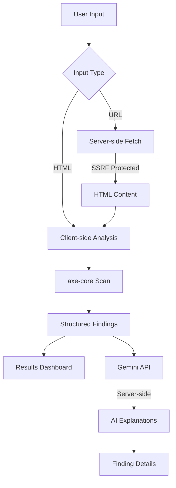

# AccessLens

**AI-Powered Web Accessibility Auditor**

AccessLens is a production-grade accessibility auditing tool that combines deterministic testing with AI-powered explanations to help developers identify, understand, and fix accessibility issues.

## Overview

AccessLens analyzes HTML for accessibility issues using [axe-core](https://www.deque.com/axe/) for reliable, standards-based detection and [Google Gemini](https://ai.google.dev/) for human-readable explanations and remediation guidance.

### Key Features

- **Deterministic Testing**: axe-core provides consistent, WCAG-compliant accessibility detection
- **AI-Powered Explanations**: Gemini delivers practical, developer-focused guidance
- **URL Fetching**: Server-side URL fetching with comprehensive SSRF protection
- **Severity-Based Results**: Issues categorized by Critical, Serious, Moderate, and Minor
- **Manual Review Items**: Identifies findings requiring human verification
- **WCAG References**: All findings include WCAG success criteria
- **Interactive Results**: Select findings to view detailed remediation guidance
- **Code Examples**: AI provides corrected code when applicable
- **Accessible Interface**: AccessLens itself meets WCAG 2.1 AA standards

## Architecture



### Design Principles

1. **Deterministic First**: axe-core performs all accessibility detection; AI only explains findings
2. **Server-Side Security**: URL validation and API keys never exposed to the client
3. **Graceful Degradation**: Full functionality without AI; fallback to axe-core help text
4. **Privacy-First**: No personal data sent to AI; only accessibility findings shared
5. **Accessibility Compliant**: AccessLens itself meets WCAG 2.1 AA standards

## Technology Stack

- **Frontend**: React 19.2.8, TypeScript 6.0.2, Vite 8.2.2
- **Styling**: Tailwind CSS 3.4.0
- **Accessibility**: axe-core 4.13.0
- **AI**: Google Gemini 1.5 Flash
- **Testing**: Vitest, React Testing Library, Playwright
- **Deployment**: Vercel with serverless functions

## Security

### SSRF Protection

URL fetching implements comprehensive SSRF protections:

- **Protocol Validation**: Only HTTP and HTTPS allowed
- **Blocked Addresses**: localhost, 127.0.0.1, private IP ranges, link-local addresses
- **Cloud Metadata**: Blocks cloud metadata endpoints (169.254.169.254)
- **Redirect Validation**: Revalidates destination after redirects
- **Request Limits**: 15-second timeout, 2MB response size limit
- **Content Validation**: Checks content-type for HTML

### API Key Security

- Gemini API key stored in `GEMINI_API_KEY` environment variable (server-side only)
- Never exposed to client code (no `NEXT_PUBLIC_*` or `VITE_*` prefix)
- `.env` file excluded from version control
- API calls made server-side via `/api/explain` endpoint

### HTML Sanitization

- User HTML sanitized before analysis
- Script tags and event handlers removed
- JavaScript protocols blocked
- Analysis performed in isolated DOM environment

## Installation

### Prerequisites

- Node.js 18+
- npm or yarn

### Setup

```bash
# Clone repository
git clone https://github.com/Gitomeh/Access-Lens.git
cd Access-Lens

# Install dependencies
npm install

# Configure environment
cp .env.example .env

# Add Gemini API key to .env
# GEMINI_API_KEY=your_api_key_here
```

### Getting a Gemini API Key

1. Visit [Google AI Studio](https://aistudio.google.com/app/apikey)
2. Create a new API key
3. Add to `.env` file
4. **Never commit `.env` or API keys**

## Development

```bash
# Start development server
npm run dev

# Run unit tests
npm test

# Run E2E tests
npm run test:e2e

# Lint code
npm run lint

# Build for production
npm run build

# Preview production build
npm run preview
```

## Deployment

### Vercel

1. Push code to GitHub
2. Import project in Vercel
3. Add `GEMINI_API_KEY` environment variable (server-side)
4. Deploy

The `/api/explain` and `/api/fetch` endpoints are deployed as Vercel serverless functions.

## Testing

### Test Coverage

- **Unit Tests**: URL validation, SSRF protection, HTML sanitization, result parsing
- **Integration Tests**: API endpoints, error handling, Gemini integration
- **E2E Tests**: Complete user flows, keyboard navigation, accessibility
- **Accessibility Tests**: axe-core against AccessLens interface

### Running Tests

```bash
# Unit tests with Vitest
npm test

# E2E tests with Playwright
npm run test:e2e

# Watch mode
npm test -- --watch
```

## Accessibility

AccessLens is designed to meet WCAG 2.1 AA standards:

- Semantic HTML structure with proper heading hierarchy
- Full keyboard navigation with visible focus indicators
- ARIA landmarks and live regions for dynamic content
- Form labels and error messages
- Sufficient color contrast (4.5:1 for text)
- Screen-reader-friendly announcements
- Responsive design for all devices

### Limitations

Automated testing cannot detect:
- Semantic appropriateness of content
- Logical reading order
- Content clarity and simplicity
- Video caption quality
- Context-dependent issues

**Manual testing is still required for comprehensive evaluation.**

## API Endpoints

### POST /api/explain

Generates AI explanations for accessibility findings.

**Request:**
```json
{
  "finding": {
    "ruleId": "button-name",
    "impact": "serious",
    "description": "Buttons must have discernible text",
    "help": "Help text",
    "html": "<button>...</button>",
    "tags": ["wcag2a", "wcag412"]
  }
}
```

**Response:**
```json
{
  "success": true,
  "data": {
    "summary": "Brief summary",
    "whyItMatters": "Impact explanation",
    "whoIsAffected": "Affected users",
    "recommendedFix": "Fix steps",
    "codeExample": "Corrected code"
  }
}
```

### POST /api/fetch

Fetches HTML from URL with SSRF protection.

**Request:**
```json
{
  "url": "https://example.com"
}
```

**Response:**
```json
{
  "success": true,
  "html": "<html>...</html>"
}
```

## Error Handling

The application handles errors gracefully:

- **Invalid URLs**: Clear validation messages
- **Blocked Addresses**: Security-focused error messages
- **Fetch Failures**: Specific error types (timeout, 403, 404, etc.)
- **HTML Errors**: Graceful handling of malformed input
- **AI Failures**: Fallback to axe-core help text
- **Rate Limits**: User-friendly retry guidance

## Performance

- **Bundle Size**: ~790KB minified
- **Lazy Loading**: axe-core loaded on-demand
- **Request Timeouts**: 15s for URL fetch, 15s for AI calls
- **Response Limits**: 2MB max for HTML content
- **Code Splitting**: Automatic via Vite

## Contributing

Contributions welcome! Please:

1. Fork the repository
2. Create a feature branch
3. Make changes with tests
4. Ensure all tests pass
5. Submit a pull request

## License

MIT License - see LICENSE file for details

## Acknowledgments

- [axe-core](https://www.deque.com/axe/) for accessibility testing
- [Google Gemini](https://ai.google.dev/) for AI-powered explanations
- [React](https://react.dev/) for the UI framework
- [Vite](https://vite.dev/) for the build tool
- [Tailwind CSS](https://tailwindcss.com/) for styling
